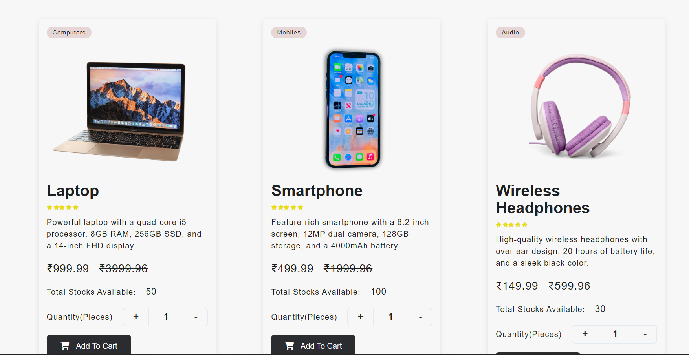
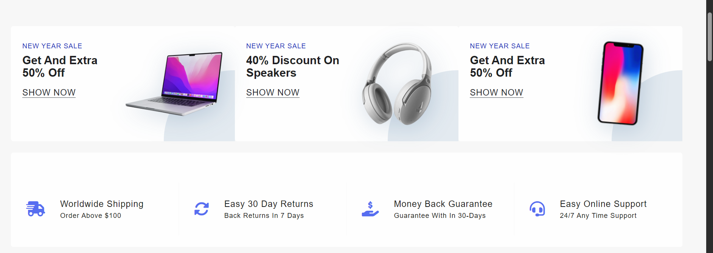
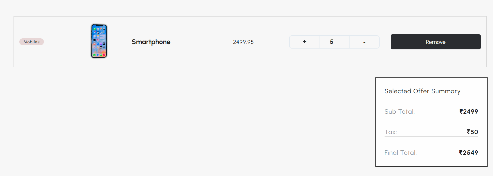

---

## 🚀 Getting Started

### Prerequisites

- [Node.js](https://nodejs.org/) v16+
- npm

### Installation

```bash
# 1. Clone the repository
git clone https://github.com/your-username/ecom-project.git<div align="center">

# ⚡ QuickTech Store

### A modern eCommerce web app built with Vanilla JavaScript & Vite

[](https://quicktechstore.netlify.app/)
[](https://developer.mozilla.org/en-US/docs/Web/JavaScript)
[](https://vitejs.dev/)
[](https://netlify.com/)

</div>

---

## 🖼️ Screenshots

| Hero Section | Product Listings |
|:---:|:---:|
|  |  |

| Offers & Deals | Cart Page |
|:---:|:---:|
|  |  |

> 🔗 **Live Preview:** [quicktechstore.netlify.app](https://quicktechstore.netlify.app/)

---

## ✨ Features

- 🛒 **Add to Cart** — persistent cart using `localStorage`
- ➕➖ **Quantity Controls** — inline increment/decrement on product cards and cart page
- 🗑️ **Remove Items** — delete individual products from cart
- 💰 **Live Cart Totals** — prices and counts update in real time
- 🔔 **Toast Notifications** — feedback on add/remove actions
- 📱 **Responsive Design** — mobile-friendly layout
- ⚡ **Vite Bundler** — fast dev server and optimized production builds

---

## 📁 Project Structure<div align="center">

# ⚡ QuickTech Store

### A modern eCommerce web app built with Vanilla JavaScript & Vite

[](https://quicktechstore.netlify.app/)
[](https://developer.mozilla.org/en-US/docs/Web/JavaScript)
[](https://vitejs.dev/)
[](https://netlify.com/)

</div>

---

## 🖼️ Screenshots

| Hero Section | Product Listings |
|:---:|:---:|
|  |  |

| Offers & Deals | Cart Page |
|:---:|:---:|
|  |  |

> 🔗 **Live Preview:** [quicktechstore.netlify.app](https://quicktechstore.netlify.app/)

---

## ✨ Features

- 🛒 **Add to Cart** — persistent cart using `localStorage`
- ➕➖ **Quantity Controls** — inline increment/decrement on product cards and cart page
- 🗑️ **Remove Items** — delete individual products from cart
- 💰 **Live Cart Totals** — prices and counts update in real time
- 🔔 **Toast Notifications** — feedback on add/remove actions
- 📱 **Responsive Design** — mobile-friendly layout
- ⚡ **Vite Bundler** — fast dev server and optimized production builds

---

## 📁 Project Structure
cd ecom-project

# 2. Install dependencies
npm install

# 3. Start the development server
npm run dev
```

### Scripts

| Command | Description |
|---|---|
| `npm run dev` | Start local dev server at `localhost:5173` |
| `npm run build` | Build optimised production bundle to `dist/` |
| `npm run preview` | Preview the production build locally |

---

## 🖼️ Images Setup

Place all product images inside the `public/images/` folder. Vite serves `public/` at the root, so images are accessible at `/images/<n>.png` in production.

In `products.json`, reference images as:
```json
"image": "/images/product-name.png"
```

> ⚠️ During development with Vite, paths like `../images/` also work, but use `/images/` for production consistency.

---

## 🛠️ Tech Stack

| Technology | Purpose |
|---|---|
| HTML5 / CSS3 | Structure & styling |
| Vanilla JavaScript (ES6+) | All interactivity & logic |
| Vite | Dev server & bundler |
| localStorage | Cart persistence |
| Netlify | Deployment |

---

## 🤝 Contributing

Contributions, issues, and feature requests are welcome!
Feel free to open an [issue](https://github.com/your-username/ecom-project/issues) or submit a pull request.

---

## 📄 License

This project is open source and available under the [MIT License](LICENSE).

---

<div align="center">

Designed & Built with ❤️ by **Rupesh**

[](https://quicktechstore.netlify.app/)

</div>---

## 🚀 Getting Started

### Prerequisites

- [Node.js](https://nodejs.org/) v16+
- npm

### Installation

```bash
# 1. Clone the repository
git clone https://github.com/your-username/ecom-project.git
cd ecom-project

# 2. Install dependencies
npm install

# 3. Start the development server
npm run dev
```

### Scripts

| Command | Description |
|---|---|
| `npm run dev` | Start local dev server at `localhost:5173` |
| `npm run build` | Build optimised production bundle to `dist/` |
| `npm run preview` | Preview the production build locally |

---

## 🖼️ Images Setup

Place all product images inside the `public/images/` folder. Vite serves `public/` at the root, so images are accessible at `/images/<n>.png` in production.

In `products.json`, reference images as:
```json
"image": "/images/product-name.png"
```

> ⚠️ During development with Vite, paths like `../images/` also work, but use `/images/` for production consistency.

---

## 🛠️ Tech Stack

| Technology | Purpose |
|---|---|
| HTML5 / CSS3 | Structure & styling |
| Vanilla JavaScript (ES6+) | All interactivity & logic |
| Vite | Dev server & bundler |
| localStorage | Cart persistence |
| Netlify | Deployment |

---

## 🤝 Contributing

Contributions, issues, and feature requests are welcome!
Feel free to open an [issue](https://github.com/your-username/ecom-project/issues) or submit a pull request.

---

## 📄 License

This project is open source and available under the [MIT License](LICENSE).

---

<div align="center">

Designed & Built with ❤️ by **Rupesh**

[](https://quicktechstore.netlify.app/)

</div>
